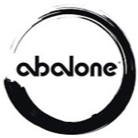
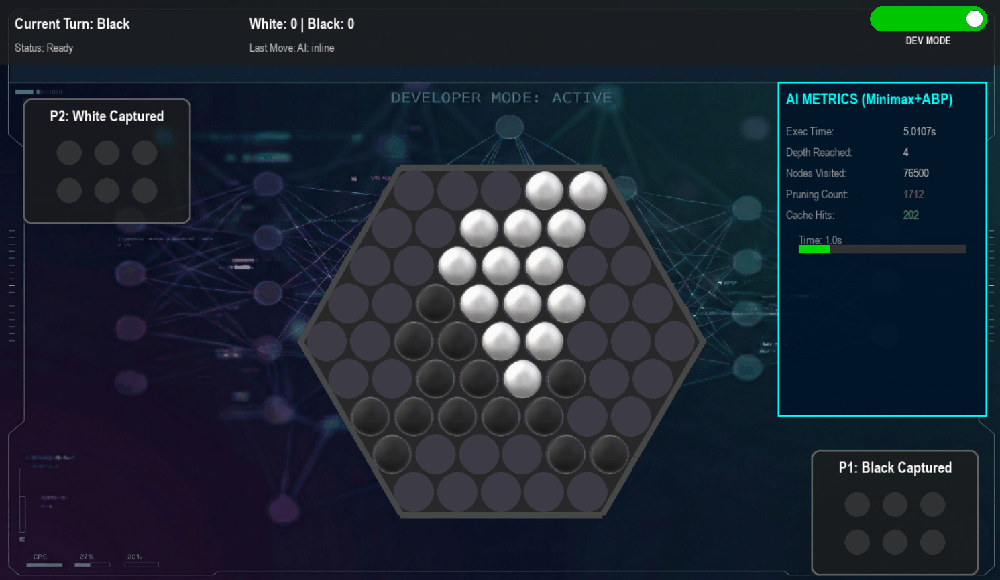
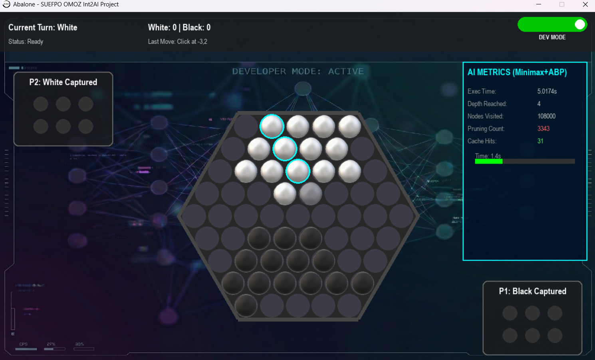

<p align="center">
  
</p>

<h1 align="center">Abalone AI Game</h1>

<p align="center">
  
  
  
</p>

<p align="center">
  <strong>Intelligent Strategy Board Game with Minimax & Alpha-Beta Pruning</strong>
</p>

<p align="center">
  A Python implementation of the classic board game featuring multiple AI algorithms with a polished graphical interface. Developed for the <strong>Int2AI</strong> course.
</p>

<br />

<p align="center">
  
</p>

<br />

## 📖 Table of Contents
- [About](#about)
- [Features](#features)
- [AI Algorithms](#ai-algorithms)
- [Technologies Used](#technologies-used)
- [Installation](#installation)
- [How to Play](#how-to-play)
- [Project Structure](#project-structure)
- [Testing](#testing)
- [Screenshots](#screenshots)
- [Contributors](#contributors)

## 📌 About

Abalone is a two-player abstract strategy board game designed by Michel Lalet and Laurent Lévi in 1987. The objective is to push six of the opponent's marbles off the hexagonal board. This project implements the game with intelligent AI opponents using various search algorithms and heuristic evaluation functions.

This project was developed as part of the **Introduction to Artificial Intelligence (Int2AI)** course at **Computer Engineering Department in Eskişehir Osmangazi University** by the lecturer **Dr. Öğr. Üyesi Savaş OKYAY** in the Fall Semester of 2025.

## ✨ Features

- 🎨 **Polished GUI** - Beautiful wood-textured board with realistic marble sprites
- 🤖 **Multiple AI Algorithms** - Choose from Greedy, ID Minimax, or Champion (Minimax + Alpha-Beta Pruning)
- ⚡ **Smooth Animations** - Linear interpolation (LERP) based marble movement animations
- 📊 **Developer Mode** - Real-time metrics dashboard showing nodes explored, search depth, and evaluation scores
- 🎯 **Ghost Preview** - Visual feedback showing potential move destinations
- 🏆 **Game Modes** - Human vs AI, AI vs AI, and Human vs Human

## 🧠 AI Algorithms

| Algorithm | Description |
|-----------|-------------|
| **Greedy** | Depth-1 search that evaluates all immediate moves and picks the best one |
| **ID Minimax** | Iterative Deepening Minimax - explores deeper with remaining time |
| **Champion (Minimax + ABP)** | Full Minimax with Alpha-Beta Pruning, Transposition Tables, Zobrist Hashing, Move Ordering, and Quiescence Search |

### Heuristic Evaluation Function
The AI evaluates board states based on multiple weighted factors:
- **Material Advantage** - Piece count difference
- **Center Control** - Pieces closer to the center are more valuable
- **Cohesion** - Grouped marbles that support each other
- **Aggression** - Rewards pushing opponent marbles
- **Danger Penalty** - Penalizes isolated edge pieces

### Advanced Techniques
- 🔄 **Zobrist Hashing** - Efficient board state caching for transposition tables
- ✂️ **Alpha-Beta Pruning** - Eliminates unnecessary branches in the search tree
- 📈 **Move Ordering** - Prioritizes captures and pushes for better pruning
- 🔍 **Quiescence Search** - Extends search on tactical positions to avoid horizon effect
- 🚫 **Repetition Detection** - Prevents infinite move loops with position history

## 🛠️ Technologies Used

- **Python 3.x** - Core programming language
- **Pygame** - Game graphics, animations, and event handling
- **Matplotlib** - Benchmark visualization and graph generation

## 📦 Installation

1. Clone the repository:
```bash
git clone https://github.com/Xepond/Abalone---SUEFPO-OMOZ-Int2AI-Project
cd Abalone---SUEFPO-OMOZ-Int2AI-Project
```

2. Install dependencies:
```bash
pip install -r requirements.txt
```

3. Run the game:
```bash
python main.py
```

## 🎮 How to Play

### Controls
- **Left Click** - Select/Deselect marbles (up to 3 in a line)
- **Left Click on target** - Move selected marbles in the clicked direction

### Rules
- Players take turns moving 1-3 marbles in a straight line
- **Inline Move** - Push marbles forward in the direction of the line
- **Sidestep Move** - Move marbles perpendicular to the line
- **Sumito (Push)** - Push opponent's marbles if you have numerical superiority
- **Win Condition** - First player to push 6 opponent marbles off the board wins

## 📁 Project Structure

```
proje/
├── main.py              # Game loop and state management
├── board.py             # Board logic, move validation, Abalone rules
├── board_ui.py          # Pygame rendering, animations, UI components
├── ai_engine.py         # AI algorithms (Greedy, IDS, Minimax, Alpha-Beta)
├── menu.py              # Main menu, settings, and game mode selection
├── ai_comparison.py     # Arena system for AI vs AI benchmarking
├── benchmark_suite.py   # Performance metrics and graph generation
├── test_ai_engine.py    # Unit tests for AI algorithms
├── assets/
│   ├── black_marble.png
│   ├── white_marble.png
│   ├── wood_table.png
│   ├── main_menu_bg.png
│   └── ...
└── README.md
```

## 🧪 Testing

Run unit tests to verify AI functionality:
```bash
python test_ai_engine.py
```

Run AI comparison benchmarks:
```bash
python ai_comparison.py
```

Generate performance graphs:
```bash
python benchmark_suite.py
```

## 📊 Performance Benchmarks

| Algorithm | Avg. Depth | Nodes/Move | Time Limit |
|-----------|------------|------------|------------|
| Greedy | 1 | ~100 | <0.1s |
| ID Minimax | 3-4 | ~10,000 | 3.0s |
| Champion | 4-5 | ~5,000 | 3.0s |

*Note: Champion explores fewer nodes due to efficient Alpha-Beta pruning while achieving deeper search.*

## 📸 Screenshots



## 👨‍💻 Contributors
**Pair #59 - SUEFPO-OMOZ - Team "Cant Talk Only TFT"**
- **Süleyman Efe POLAT** - 3rd Year Computer Engineering Student [](https://github.com/Xepond)
- **Ömer ÖZKAN** - 3rd Year Computer Engineering Student [](https://github.com/merzkan1)

## 📄 License

This project is licensed under the **MIT License** - see the [LICENSE](LICENSE) file for details.

This project was developed for educational purposes as part of the Int2AI course project.

---

*Made with ❤️ and Python*
